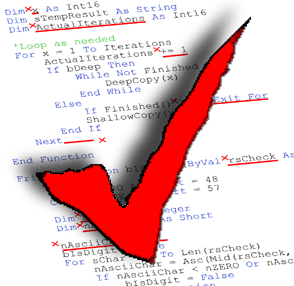

  

## Before the standard
Before using coding standards, I had been formatting my code to personal preference, adjusting it visually to how I felt it would be easier to comprehend. One such unorthodox adjustment I enacted were the curly braces for functions being placed on a seperate line fo the function name. When I first learned coding, I found it hard to keep track of the opening and closing braces of the functions/classes. As the instructors had their beginning curly braces opened on the same line of the function's creation, it differed greatly aesthetically from my code. This caused a great rift in how a person viewed my code compared to everyone else which slowed down the process of grading.

## My experience with ESLint in IntelliJ
When I was first taught about coding standards, the idea of using one set of coding guidelines made sense, as my previous experience displayed the need for some sense of normality when formatting code. However, as I implemented the necessary files and npm installed eslint into my project, I found myself actually struggling to adhere to the standard. Many of my previous habits were unknowingly marked red/incorrect for the standard, leading me to correct them one by one in order to follow the rules. Just the misplaced spacing could cause a red mark to appear on my code which made me more attentitive towards my spacing. 

## Current Opinions
Little by little, I find myself subconciously following the standard which in itself brings a sense of accomplishment towards making quality code. My code that used to look abismal and scattered, now takes on a more pleasing organized polished look. I no longer find myself taking the quick way of ommiting spaces when declaring varibles. Now I subconciously space the operators and equal signs from my variable when declaring them. Although it takes mroe time to follow ESlint standards, I find it mroe enjoyable and easier to read my code compared to prior learning of ESlint.
