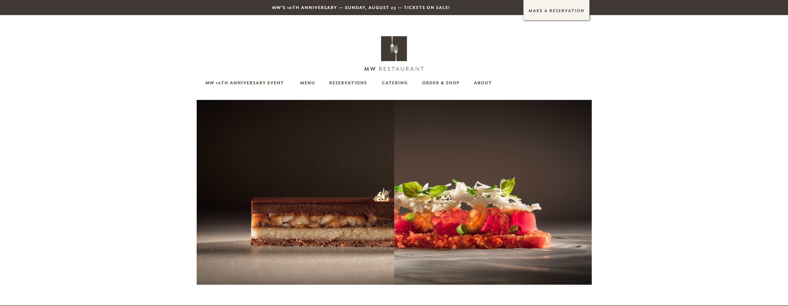
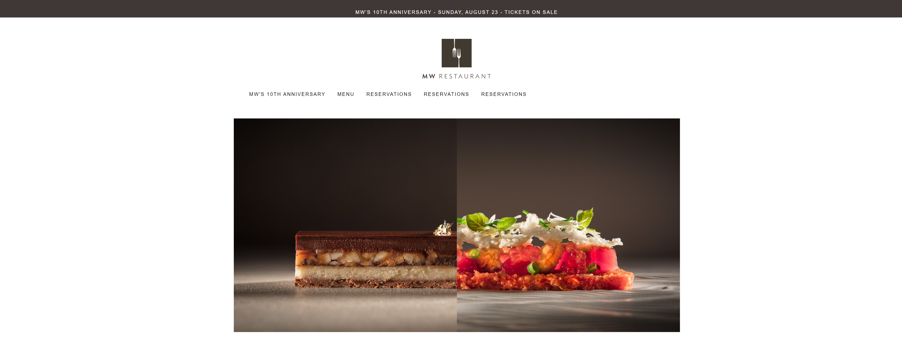

## Framework makes the Dreamworks.....website

Going into HTML/ CSS, the thought of having to make different versions to different screen sizes for webpages being developed never came to me, and this ignorance brought out more appreciation for frameworks when I was revealed their roles in multiplatform integration. previously, I had the belief that in order to be displayed ona phone, you would either need to create an app or anotehr version of the website to remove any inconvenience in the change of viewing experience, but after being taught about bootstrap 5, I learned this process could be done with fewer steps and resources needed. Websites like disney and other well known brands manage to show different versions of their websites on mobile devices through a single webpage file. this can be done with tools such as bootstrap and other frameworks which makes my viewpoint of these tools full of excitement.

## First hands on experience with bootstrap
During my first experience with bootstrap emulating a website, It shocked me that recreating another front end of an existing website became much less difficult with the popular bootstrap tools that simplify the process of creating sections of the webpages appearance. I no longer had to write the code for the default padding, display types and/or other essential features that bootstrap has with its classes. My first serious remake came with the website, mwrestaurants.com, a local fine dine restaurant that has its home webpage separated into a main naviagation section, and a footer section.
This is the front end main section of teh website with the navigation links above a showcase picture

In order to recreate the frontend for this page, bootstrap gave a set of tools such as its container fluid class and  navbar classes that allowed a more simplistic development that didn't neeed much padding and/or margin change for the contents within it. My version ended up with similar features such as the top navbar and the centered image shown below. This would ahve ussually taken twice as long as what it took to accomplish this without bootstrap classes.

## Current Thoughts

In the present, adapting to bootstrap made css a little less of a hassle to implement, while allowing a more broader spectrum of frontends to be made efficiently thanks to the generalised standard that bootstrap provided. I feel that the addition of bootstrap is one of the most essential tools that I have been taught.
