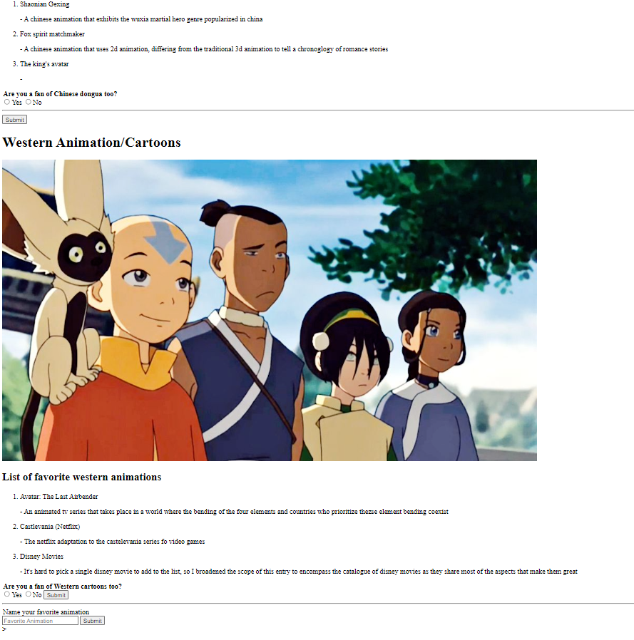

After taking my first programming class, I wanted to learn HTML, and this website was my first experience creating a basic webpage utilizing HTML 5. The website 
uses header and p tags for text, has hyperliks embedded into text, images displayed for visual representations, and radio buttons that takes your choice as input. 
The website is composed of three sections that are divided with div tags. Each section has a single picture of the animation for the style the section mainly
focuses on. It also contains a prompt composed of a label, radio buttons, and regular buttons asking if you enjoyed this specific style of animation in your own 
life. I arranged my list for each style to be under the pictures of each section in an ordered list. 

For each lsit, three of my favorite animations are listed alongside my personal interepretation of how these shows/films were portrayed as. The ordered list is 
positioned just below the pictures and titles of the section uniformly. Each pictures are adjusted with their height and width to a bigger scale than they're 
intial values in order to match the length of the ordered lists. This project utilizes the basic functions of HTML to facilitate a visual representation of 
my list of favorite animations and design a layout to show the subjects with optional user interaction in the radio buttons. 

The main section of the website is also separated from the footer section with a hr tag to differentiate the body content from the final activity of entereing text 
in a text area input. The final input, the text area has a default shadow value included to show what type of answer is meant to be placed inside the box. A submit
button is positioned next to the text area to act as a signifier of completion.

This is the code for the Chinese animation section of the website's html:

```cpp
<div>
  <h1>Chinese Animations/Donghua</h1>
  
  <h2>List of favorite chinese animations</h2>
  <ol>
    <li>Shaonian Gexing</li><p> - A chinese animation that exhibits the wuxia martial hero genre popularized in china</p>
    <li>Fox spirit matchmaker</li><p> - A chinese animation that uses 2d animation, differing from the traditional 3d animation to tell a chronoglogy of romance stories</p>
    <li>The kings avatar</li><p> - </p>
  </ol>
  <legend><b>Are you a fan of Chinese dongua too?</b></legend>
  <label>
  <input type="radio">Yes
  </label>
  <label>
  <input type="radio">No
  </label>
  <hr>
  <button>Submit</button>
</div>
```

